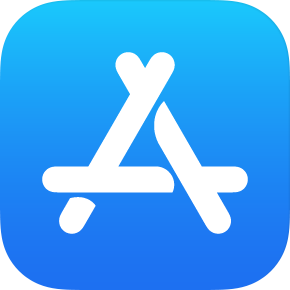
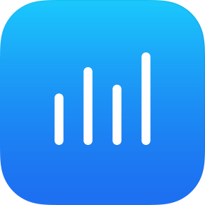
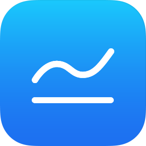
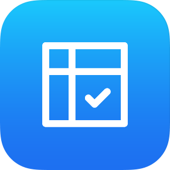
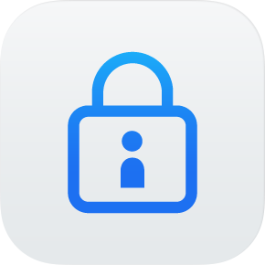
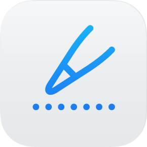

# A Guide to App Store Connect

## App Store Connect Website

> The following details each section of the App Store Connect website.

### My Apps

`My Apps` is where you can create, update, and manage all of your apps. Within each app, you can add information that will be seen on the App Store, access TestFlight, create promotion codes, and more.

### App Analytics

`App Analytics` is where you can monitor your app's KPIs, including: impressions, units sold, sales, sessions, crashes, and more. App Store Connect only shows data from users who have agreed to share their diagnostics and usage information with app developers.

### Sales & Trends

`Sales and Trends` is where you can see all the data related to your app sales (installs, in-app purchases, subscriptions, etc). The data is conveniently shown in graphs, and hovering over them will give more information.

### Payments & Financial Reports

`Payments and Financial Reports` is where you can find expenses reports for a given time period.

### Users & Access

`Users and Roles` is where you can manage what access is granted to which users, add new users, and manage existing ones.

### Agreements, Tax, & Banking

`Agreements, Tax, & Banking` is where you will accept the Paid Applications Agreement, enter your tax and contact information, and set up electronic banking.

## iOS App

App Store Connect also has an iPhone app, which can be downloaded [on the App Store](https://apps.apple.com/us/app/app-store-connect/id1234793120) for free. This app helps developers manage apps that are available in the App Store. Developers can use App Store Connect to monitor their latest trends, receive notifications from user reviews, and respond to customer reviews immediately from their iPhone, iPad, and iPod touch.
